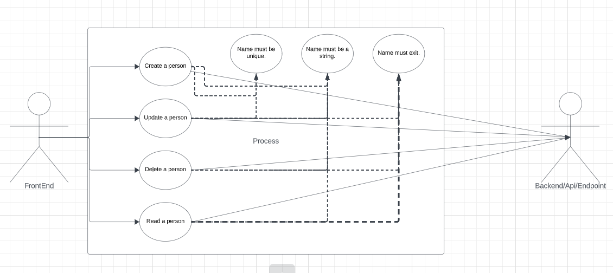
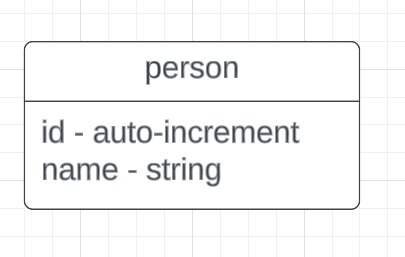

# REST API CRUD Operation on "Person"
An API that dynamically handle parameters, such as adding, retrieving, updating or deleting a person by user_id (CRUD operation).

## HOW TO SET UP THIS PROJECT IN YOUR LOCAL MACHINE

### START (LARAVEL WEB SITE) LOCAL DEV

    clone this repository to your local machine
    run composer update && composer dump-autoload on your terminal
    run php artisan key:generate && php artisan migrate terminal
    Transfer all content in .env.example to a new file .env
    configure the .env
    Then run php artisan serve to serve the application on local machine

### Testing the API
    
    Get the local url ie localhost:8000/api
    test using tools like postman

## ABOUT THE PROJECT

### API Source Code 

    https://github.com/codejutsu1/Hng-task-two

### UML and E-R Diagrams

##API DOCUMENTATION

## FORMATS FOR EACH ENDPOINT

### CREATE A PERSON

    {
        "message" : "Request was successful",
        "data" : {}, 
        "status_code" : 201,
    }

### READ A PERSON

    {
        "message" : "Request was successful",
        "data" : {}, 
        "status_code" : 200,
    }

### UPDATE A PERSON

    {
        "message" : "Request was successful",
        "data" : {}, 
        "status_code" : 200,
    }

### DELETE A PERSON

    {null}